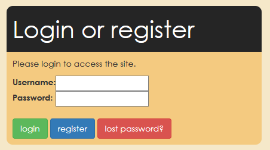

## Introduction
This app will serve a number of purposes:

* Academic: repeat old offerings and create new ones
* Finance: input fee information, compare courses, reference funding information
* Marketing: retrieve core information about course, along with marketing-specific text and details
* CIS: export single combined document containing all data, optimised for import into ProSolution with minimal effort
* Registers: allow timetables and sessions to be scheduled in advance as far as possible
* Premises: highlight courses that will run on Saturdays (i.e. when the college will need to be opened outside of usual hours)
* Forecasting: project income based on min/max student numbers, LARS funding, planned fees, and (where repeat) actual number of enrolments in previous academic year

## User Guide
The website will require users to register for an account before they can begin working on their plan, and different user groups will have different access rights and interfaces.

Only staff with @bathcollege.ac.uk email address will be able to register.

